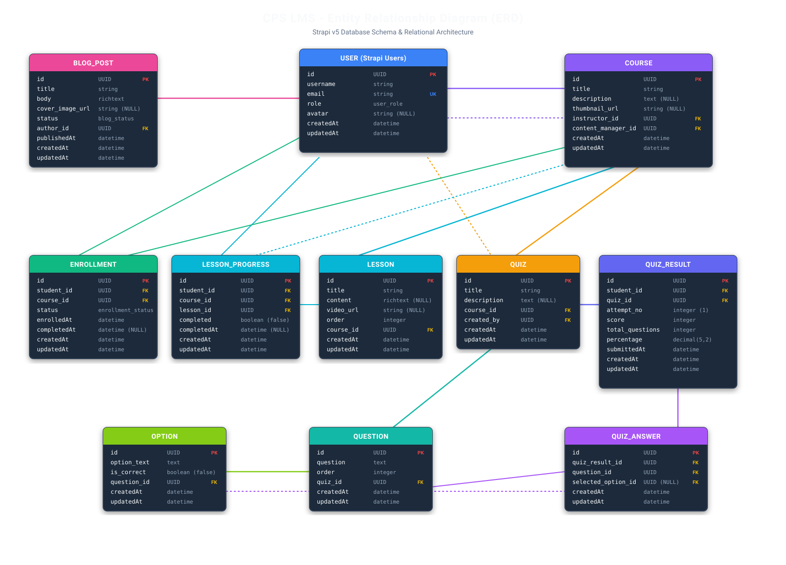

# CPS Learning Management System (LMS) Backend

This is the backend for the CPS Learning Management System, built on **Strapi v5** (Headless CMS) using **TypeScript** and **PostgreSQL**. The backend is architected to be secure, dynamic, and fully aligned with the project's customized Entity-Relationship Diagram (ERD).

---

## 📁 Project Structure (প্রজেক্ট স্ট্রাকচার)

```text
cps-lms-backend/
├── config/                         # System & plugin configurations
│   ├── admin.ts                    # Admin panel setup & secret keys
│   ├── api.ts                      # API responses & pagination settings
│   ├── database.ts                 # PostgreSQL database connection setup
│   ├── middlewares.ts              # Global Strapi middleware configurations (CORS, Security, etc.)
│   ├── plugins.ts                  # Installed plugins configuration (Users-Permissions, Documentation)
│   └── server.ts                   # Web server host, port, and app keys configuration
│
├── src/                            # Main application source code
│   ├── index.ts                    # Lifecycle hooks (user role auto-assignment) & Swagger OpenAPI overrides
│   │
│   ├── api/                        # Custom API content-types and business logic modules
│   │   ├── blog-post/              # Blog posts published by content managers/authors
│   │   │   ├── content-types/      # Schema definition JSON for blog-post
│   │   │   ├── controllers/        # Auto-assigns logged-in user as author on creation
│   │   │   ├── routes/             # REST endpoints (/api/blog-posts)
│   │   │   └── services/           # Strapi core service wrappers
│   │   │
│   │   ├── course/                 # Core Course management module
│   │   │   ├── content-types/      # Schema definition (title, description, price, thumbnail, relations)
│   │   │   ├── controllers/        # Auto-assigns logged-in instructor/content manager; auto-populates instructor info
│   │   │   ├── routes/             # REST endpoints (/api/courses)
│   │   │   └── services/           # Core course service
│   │   │
│   │   ├── lesson/                 # Lessons belonging to a course
│   │   │   └── ...                 # Schema, controllers, routes, and services
│   │   │
│   │   ├── lesson-progress/        # Student lesson completion tracking
│   │   │   └── ...                 # Auto-assigns student on creation
│   │   │
│   │   ├── enrollment/             # Student course enrollment records
│   │   │   └── ...                 # Auto-assigns logged-in student on purchase/enrollment
│   │   │
│   │   ├── quiz/                   # Quiz assessments linked to courses
│   │   │   └── ...                 # Auto-assigns created_by user ID
│   │   │
│   │   ├── question/               # Individual questions belonging to a quiz
│   │   │   └── ...                 # Links to quiz and options
│   │   │
│   │   ├── option/                 # Answer choices for quiz questions
│   │   │   └── ...                 # Contains option_text and is_correct flag
│   │   │
│   │   ├── quiz-result/            # Stores overall student quiz scores and attempts
│   │   │   └── ...                 # Auto-assigns student on submission
│   │   │
│   │   └── quiz-answer/            # Detailed logs of student's specific selected answers
│   │       └── ...                 # Links quiz_result, question, and selected_option
│   │
│   ├── extensions/                 # Strapi core plugin extensions
│   │   ├── documentation/          # OpenAPI/Swagger custom overrides & configuration
│   │   └── users-permissions/      # Custom user schemas and role modifications
│   │
│   ├── services/                   # Custom business services & helper algorithms
│   │   ├── enrollment/             # Custom enrollment verification services
│   │   ├── progress/               # Progress calculation services
│   │   └── quiz/                   # Custom quiz score evaluation engine (calculate-result.ts)
│   │
│   ├── middlewares/                # Custom application-level middlewares
│   ├── policies/                   # Custom route security policies
│   └── utils/                      # Helper utilities, constants, and validators
│
├── public/                         # Static assets directory
├── database/                       # Database migrations & seeds
├── package.json                    # Project dependencies and script runner
└── tsconfig.json                   # TypeScript compiler configuration
```

---

## 🔗 Entity Relationships & Connections (কার সাথে কে Connected)

The backend utilizes strict relational mapping between users (Students, Instructors, Content Managers) and content entities. Below is the system relationship diagram and detailed mapping.

### 📊 Complete Entity-Relationship Diagram (ERD Schema)



<details>
<summary><b>Click to expand / view Mermaid Diagram Code</b></summary>

```mermaid
erDiagram
    USER {
        UUID id PK
        string username
        string email UK
        user_role role
        string avatar NULL
        datetime createdAt
        datetime updatedAt
    }

    BLOG_POST {
        UUID id PK
        string title
        richtext body
        string cover_image_url NULL
        blog_status status
        UUID author_id FK
        datetime publishedAt NULL
        datetime createdAt
        datetime updatedAt
    }

    COURSE {
        UUID id PK
        string title
        text description NULL
        string thumbnail_url NULL
        UUID instructor_id FK
        UUID content_manager_id FK
        datetime createdAt
        datetime updatedAt
    }

    ENROLLMENT {
        UUID id PK
        UUID student_id FK
        UUID course_id FK
        enrollment_status status
        datetime enrolledAt
        datetime completedAt NULL
        datetime createdAt
        datetime updatedAt
    }

    LESSON {
        UUID id PK
        string title
        richtext content NULL
        string video_url NULL
        integer order
        UUID course_id FK
        datetime createdAt
        datetime updatedAt
    }

    LESSON_PROGRESS {
        UUID id PK
        UUID student_id FK
        UUID course_id FK
        UUID lesson_id FK
        boolean completed
        datetime completedAt NULL
        datetime createdAt
        datetime updatedAt
    }

    QUIZ {
        UUID id PK
        string title
        text description NULL
        UUID course_id FK
        UUID created_by FK
        datetime createdAt
        datetime updatedAt
    }

    QUIZ_RESULT {
        UUID id PK
        UUID student_id FK
        UUID quiz_id FK
        integer attempt_no
        integer score
        integer total_questions
        decimal percentage
        datetime submittedAt
        datetime createdAt
        datetime updatedAt
    }

    QUESTION {
        UUID id PK
        text question
        integer order
        UUID quiz_id FK
        datetime createdAt
        datetime updatedAt
    }

    OPTION {
        UUID id PK
        text option_text
        boolean is_correct
        UUID question_id FK
        datetime createdAt
        datetime updatedAt
    }

    QUIZ_ANSWER {
        UUID id PK
        UUID quiz_result_id FK
        UUID question_id FK
        UUID selected_option_id FK
        datetime createdAt
        datetime updatedAt
    }

    USER ||--o{ BLOG_POST : "author"
    USER ||--o{ COURSE : "instructor"
    USER ||--o{ COURSE : "content_manager"
    USER ||--o{ QUIZ : "created_by"
    USER ||--o{ ENROLLMENT : "student"
    USER ||--o{ LESSON_PROGRESS : "student"
    USER ||--o{ QUIZ_RESULT : "student"

    COURSE ||--o{ LESSON : "lessons"
    COURSE ||--o{ QUIZ : "quizzes"
    COURSE ||--o{ ENROLLMENT : "course"
    COURSE ||--o{ LESSON_PROGRESS : "course"

    LESSON ||--o{ LESSON_PROGRESS : "lesson"

    QUIZ ||--o{ QUESTION : "questions"
    QUIZ ||--o{ QUIZ_RESULT : "attempts"

    QUESTION ||--o{ OPTION : "options"
    QUESTION ||--o{ QUIZ_ANSWER : "question"

    QUIZ_RESULT ||--o{ QUIZ_ANSWER : "answers"

    OPTION ||--o{ QUIZ_ANSWER : "selected_option"
```
</details>

### Detailed Entity Connection Table

| Entity | Related To | Relation Type | Description |
| :--- | :--- | :--- | :--- |
| **`User` (Student)** | `Enrollment` | 1 : Many | A student can enroll in multiple courses. |
| **`User` (Student)** | `Lesson Progress` | 1 : Many | Tracks completion status of individual lessons for the logged-in student. |
| **`User` (Student)** | `Quiz Result` | 1 : Many | Holds attempt scores, percentages, and results for assessments taken by the student. |
| **`User` (Instructor)** | `Course` | 1 : Many | Instructors are linked to courses they create (`instructor` field). |
| **`User` (Content Mgr)** | `Course` / `Blog` | 1 : Many | Content managers oversee courses (`content_manager` field) and publish blogs (`author` field). |
| **`Course`** | `Lesson` | 1 : Many | A course contains multiple ordered lessons. |
| **`Course`** | `Quiz` | 1 : Many | A course contains quizzes to evaluate student performance. |
| **`Course`** | `Enrollment` | 1 : Many | Tracks all student enrollment records for the course. |
| **`Quiz`** | `Question` | 1 : Many | A quiz consists of multiple multiple-choice questions. |
| **`Question`** | `Option` | 1 : Many | Each question has multiple answer choices (`option_text`, `is_correct`). |
| **`Quiz Result`** | `Quiz Answer` | 1 : Many | Contains granular student choices for each question in a quiz attempt. |

---

## ⚙️ How It Works (কিভাবে কাজ করে)

The backend automates data persistence, role assignment, and relational mapping to simplify frontend implementation.

### 1. User Registration & Role Auto-Binding Workflow
- **Input**: User submits `{ username, email, password, user_role: "student" | "instructor" | "content_manager" }`.
- **Lifecycle Hook (`src/index.ts`)**: A `beforeCreate` lifecycle hook intercepts the request, looks up the corresponding Strapi Role ID matching `user_role`, and automatically binds the proper security role before saving to PostgreSQL.
- **Output**: Returns JWT authentication token and complete user profile details.

### 2. Smart Course Creation Workflow
- **Instructor / Content Manager Action**: Sends a `POST /api/courses` payload containing course metadata (`title`, `description`, `price`, `thumbnail_url`).
- **Controller Auto-Assignment (`src/api/course/controllers/course.ts`)**:
  1. Extracts the authenticated user ID from `ctx.state.user`.
  2. Automatically injects `instructor: user.id` (and `content_manager: user.id` if applicable) into the data payload.
  3. Frontend does not need to manually pass user IDs in the request body.

### 3. Student Course Enrollment Workflow
- **Student Action**: Sends `POST /api/enrollments` with `{ data: { course_id: "..." } }`.
- **Controller Logic (`src/api/enrollment/controllers/enrollment.ts`)**:
  1. Validates that the requesting user is logged in as a `student`.
  2. Auto-injects the student's authenticated ID into the `student` relational field.
  3. Saves the active enrollment record.

### 4. Progress & Quiz Assessment Evaluation Flow
- **Lesson Completion**: When a student finishes a lesson, `POST /api/lesson-progresses` records completion status, automatically linking `student`, `lesson`, and `course`.
- **Quiz Submission & Grading (`src/services/quiz/calculate-result.ts`)**:
  1. Student submits answers via `POST /api/quiz-results` and `POST /api/quiz-answers`.
  2. The custom quiz service compares submitted `selected_option_id` against `is_correct` flags in the database options table.
  3. Calculates correct answers, total percentage score, and logs attempt results tied to the student's profile.

### 5. Frontend-Friendly Swagger Documentation System
- **OpenAPI Override (`src/index.ts`)**: Overrides default Strapi documentation schemas.
- Removes backend auto-assigned fields (like `student`, `instructor`, `created_by`) from Swagger request body examples.
- Clearly exposes exact relational document IDs required from the frontend (`course_id`, `lesson_id`, `quiz_id`, `question_id`, `selected_option_id`).

---

## 🚀 Getting Started & Local Setup

### Prerequisites
- **Node.js**: v18.x or higher
- **Database**: PostgreSQL server running locally or on cloud (e.g. Railway)

### Installation & Execution

1. **Clone & Install Dependencies**:
   ```bash
   npm install
   ```

2. **Configure Environment Variables (`.env`)**:
   ```env
   HOST=0.0.0.0
   PORT=1337
   APP_KEYS=your_app_keys
   API_TOKEN_SALT=your_api_salt
   ADMIN_JWT_SECRET=your_admin_jwt
   TRANSFER_TOKEN_SALT=your_transfer_salt
   DATABASE_CLIENT=postgres
   DATABASE_HOST=127.0.0.1
   DATABASE_PORT=5432
   DATABASE_NAME=cps_lms
   DATABASE_USERNAME=postgres
   DATABASE_PASSWORD=your_db_password
   JWT_SECRET=your_jwt_secret
   ```

3. **Run Development Server**:
   ```bash
   npm run develop
   ```

4. **Access Interactive API Documentation (Swagger)**:
   Navigate to [http://localhost:1337/documentation/v1.0.0](http://localhost:1337/documentation/v1.0.0) while the dev server is running.
